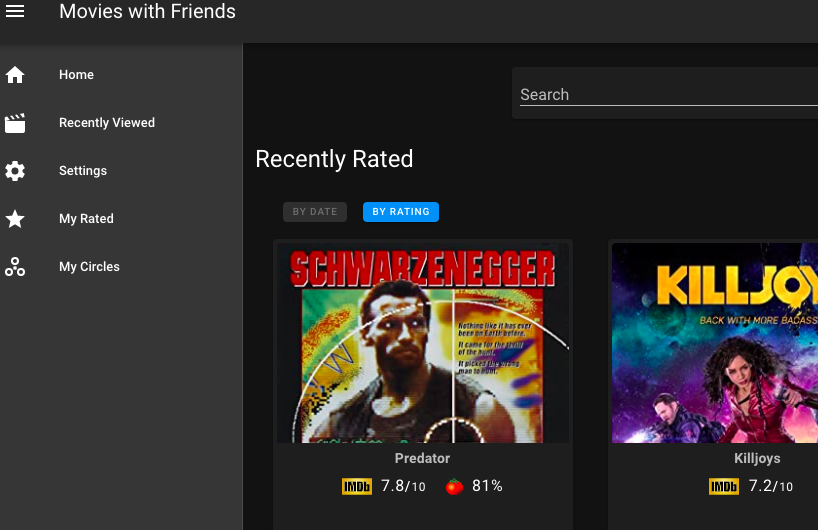
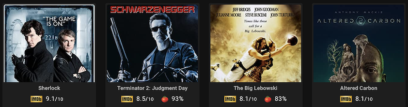
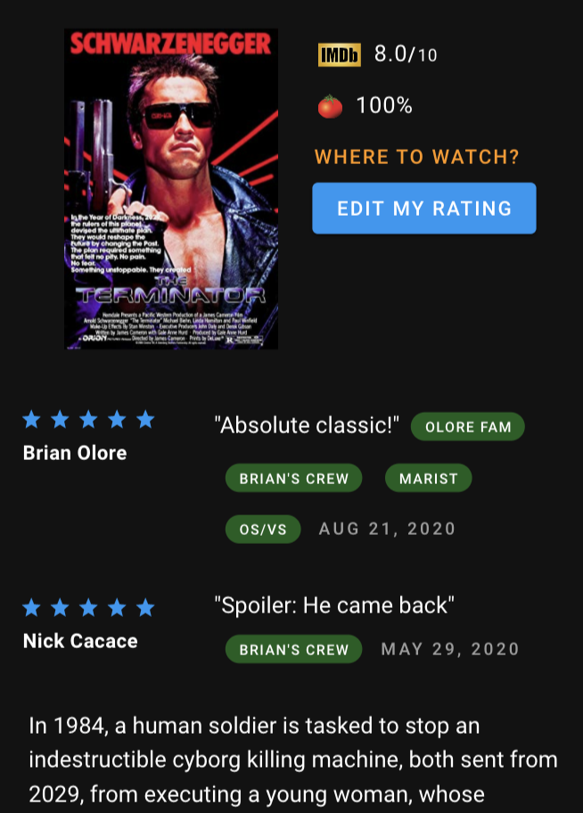

# MovieRex
*Get it? like Movie Recs... like Movie Recommendations*

Try it out: https://movierex.olore.net

<hr />

## Find Movies & TV Shows


## See IMDB & Rotten Tomatoes ratings


## What do your friends think?


<hr />

## Project setup
```
npm install
```

Get a key from https://www.omdbapi.com/

Create a `.env` file with
```
API_KEY=omdb_api_key
DB_FILE_PATH=/path/for/dbs
```

### Run Development 
```
npm run start:dev
```

### Run Production
Build it with `npm run build`
Run it with
* Frontend: Host `dist/` somewhere (like `python -m SimpleHTTPServer 3000`)
* Backend: `npm run start`

### Testing
Visual Regression
 - `npm run regression:setup` - initial setup of base snapshots
 - `npm run regression:run` - run visual regression tests 
   - right now these are the same as the regular cypress tests!
## Future?
* More data - https://www.imdb.com/interfaces/
* Magic Login - https://magic.link/home
* More data - https://www.guidebox.com/register
* Horizontal Scrolling - https://github.com/Akryum/vue-virtual-scroller

## Thanks
* [VueJS](https://vuejs.org/) JavaScript framework
* [Vuetify](https://vuetifyjs.com/) component framework
* [Fastify.io](https://www.fastify.io/) Node.js server side framework (no express!)
* [Open Movie Data Base](https://www.omdbapi.com/) API
* [NeDB](https://github.com/louischatriot/nedb) in memory/file based document store
* [Google Signin Button](https://github.com/mejiamanuel57/vue-google-signin-button-directive) "inspiration"
* [Infinite Loader](https://peachscript.github.io/vue-infinite-loading/) component
* [Favicon](http://www.iconarchive.com/show/captiva-icons-by-bokehlicia/movie-icon.html)